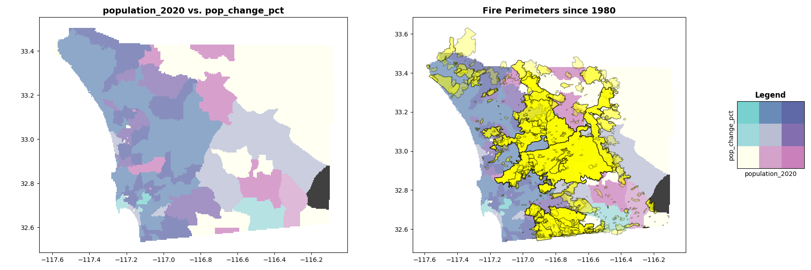
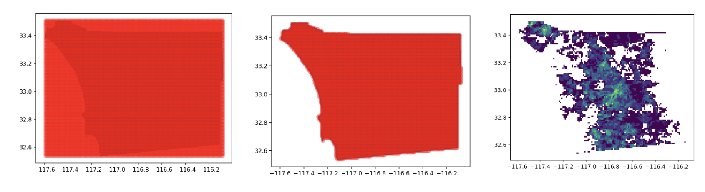

# A favorite* data visualization: Bivariate Choropleths 
*These maps are fun to make and pack a lot of information into a small space. However, they can be difficult to read and interpret. It's realistically not a visualization I would recommend for routing reporting or most practical use cases, but they can be eye catching. 

I'll take a stab at making one and describe the process.

## Output 
Here is the output - a map of San Diego county, shaded according to the interaction of two variables: Population in 2020 Census vs. Population Change 2010 to 2020 Census. The plot on the right adds a layer showing wildfire perimeters since 1980. These datasets might come together to answer a question like: "What fast-growing or highly populated areas of SD county have the highest historical exposure to wildfires (and presumably, the highest future-facing wildfire risk)?" 

Overall, what I take away from this is that the highest-risk, fastest-growing areas look like Scripps Ranch and Poway on the north inland side of the city, with similar zones in Otay/Chula Vista on the south side of the city and near Escondido or Valley Center (hard to tell precisely without a basemap). This makes sense against what I know about fire history and real estate trends in the county. Follow-up questions might ask if there's a relationship between fire risk and population growth: for example, if fires are started by people, does population growth lead to more fires? Or, perhaps fire-prone exurbs may be more affordable; do people tend to move to these areas as a way to find more affordable housing, despite the risks?  

Inspired by: https://waterprogramming.wordpress.com/2022/09/08/bivariate-choropleth-maps/

## Process steps
- Collect public data on 2 or more variables of interest. I chose:
    - 2020 Census population for San Diego County, by ZIP code, from opendata.sandag.org
    - 2010 Census population for San Diego County, by ZIP code, from opendata.sandag.org
    - Historical Wildfire Perimeters from the California State Geoportal, gis.data.ca.gov
    - wkt geometry (as polygons**) of ZIP codes in San Diego county from 

- Prepare a combined dataset. Population data exists at ZIP code level, but wildfire data covers continuous space. If I'm interested in exploring both variables against each other, I'll have to find a way to map them against each other.
    - An easy way to do this would be a simple spatial join wildfire perimeters onto ZIP codes: which (or many) wildfires have burned in this ZIP code? 
    - A slightly more interesting and informative way is to create a grid of pixels over the area of interest. This allows us to change the resolution at which we work. We could work with 1km x 1km pixels if we're interested in neighborhood-level dynamics, or much larger pixels if that better suits that constraints of the problem and computational needs.  
- To create the grid, I first find the extents of all ZIP codes in San Diego county. I then:
    - Generate pixels according to a parameter `cell_size` covering the extents. I tried a few values for `cell_size` but squares of 1km to a few hundred meters seem to make the most sense. 
    - Use a spatial join to trim that grid of pixels to only the areas covered by a ZIP codes (i.e., eliminating ocean areas)
    - To further illustrate, I plot a variable of interest - in this case, number of wildfires historically observed in a 1km-square pixel - as a color scale against the grid of pixels. 

- From there, I use a combination of relational and spatial joins to create a geoDataFrame storing, for each pixel, its geometry, its population in 2020, 2010, the % change in population between 2010 and 2020, and the number of wildifre perimeters intersecting that square kilometer since 1980. 
- Colorscale: I defined the colorscale as a 3x3 grid of colors to mimic the example. Each pixel is assigned a color based on the quantile it ranks in 2 variables (bottom, middle, or top third).

**Fun fact that has been relevant in past work I've done: ZIP codes are actually not polygons contiguously covering a city. They are technically linear features comoprised of groups of street addresses, but representing them as polygons is often more practical. [More info here](https://www.nku.edu/~longa/modules/av/lab/zips/zip_codes.html#:~:text=Zip%20codes%20are%20linear%20features,be%20covered%20by%20rational%20polygons.)

## Readability considerations and other ideas 
- Red vs. Blue: to mimic the example, I used a teal/pink/purple colorscale. (Accidental Padres alt. colors?). A blue/red/purple or yellow/blue/green colorscale might be more easily interetable as more readers are familiar with those color combinations. 
- 3x3 vs 4x4: in addition to experimenting with different colormap endpoints, would a more continuous-appearing colorscale improve readability? Might try this out.
- Basemap and Interaction: it would be much more user-friendly to map this on a zoomable HTML object, with a basemap and (possibly) with the ability to toggle layers on or off. This can be done with a little extra working using Folium. 
- Infrequent events: Aggregating the number of fires per square-km didn't work as well as I had hoped. It looks relatively informative in the first plot above (yellow/green/purple), but fires are rare enough that the percentile-based color selection doesn't work well. Most pixels have 0 or 1 fire perimeter since 1980, making for an uninteresting and uninformative amount of variation in the data. Consider if there are other ways to summarize or map infrequently-ocurring events. 
- Spatial statistics: in a real problem setting, I would suggest looking into some spatial correlation methods like Cross-Moran's I. Some of these are available in software libraries (Python's pointpat, e.g.) or built into software tools like ArcGIS, although they seem to be more commonly used for measuring autocorrelation (clustering vs. dispersion) of point processes. Visually looking at the layering of two or more datasets is only an interesting starting point.
- CRS: I played fast and loose with the coordinate reference systems here, and many source datasets did not document CRSs for geoemetries. I think it probably worked OK since things appear to have shown up correctly on the maps, but this is another area I would check for accuracy. 
